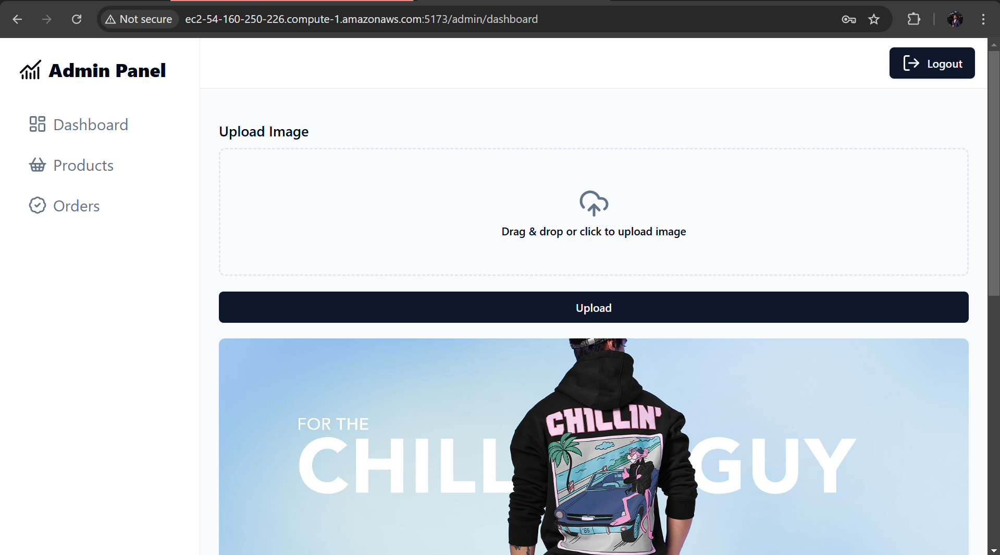
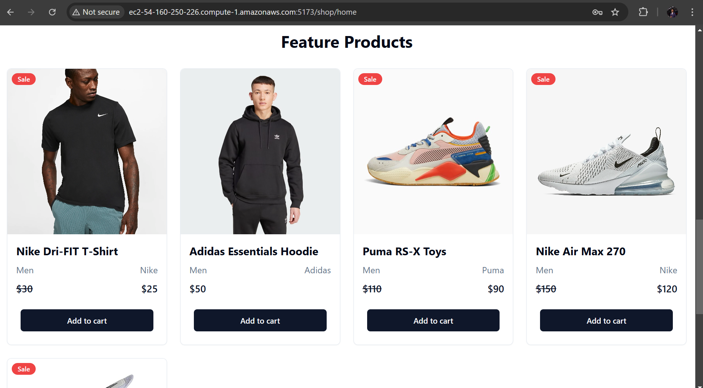
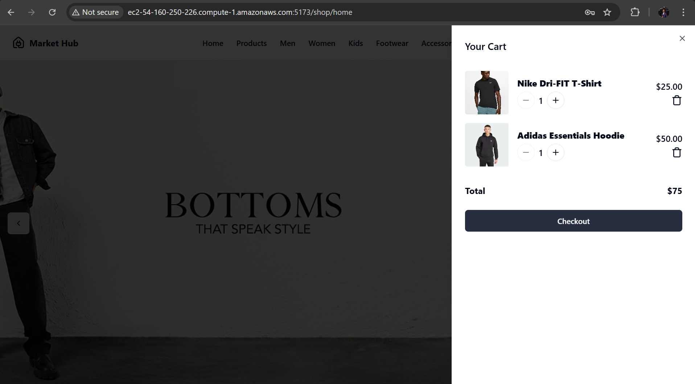
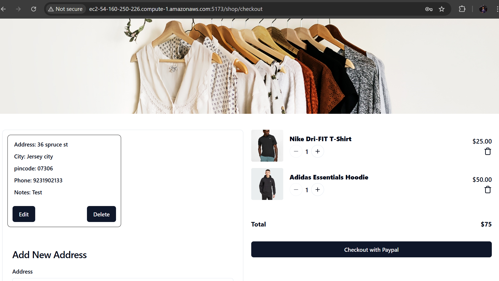

# Market Hub

Market Hub is a full-stack e-commerce platform built using React (Vite), Node.js, and MongoDB. The platform includes both user and admin views, enabling a seamless shopping experience with PayPal integration for secure transactions.


## Screenshots


1. **Admin Panel:**
   
2. **User Portal:**
   
3. **Products View:**
   
4. **Shopping Cart:**
      
5. **Checkout with PayPal:**
   


## Features

- **User View:**
  - Browse and search for products
  - Add items to cart and manage quantity
  - Checkout with PayPal for secure payments
  - Address management for streamlined order fulfillment

- **Admin View:**
  - Dashboard for managing products and orders
  - Upload and update product images
  - Manage customer orders
  
- **Deployment:**
  - Hosted on **AWS EC2** for high availability and scalability
  - Optimized for performance and smooth user experience

## Tech Stack

- **Frontend:** React (Vite), Tailwind CSS
- **Backend:** Node.js, Express.js
- **Database:** MongoDB
- **Authentication:** JWT (JSON Web Token)
- **Payment Gateway:** PayPal
- **Deployment:** AWS EC2

## Installation & Setup

### Prerequisites
Ensure you have the following installed:
- Node.js
- MongoDB

### Steps to Run Locally

1. Clone the repository:
   ```sh
   git clone https://github.com/your-repo/market-hub.git
   cd market-hub
   ```

2. Install dependencies for both frontend and backend:
   ```sh
   cd client  # Navigate to frontend
   npm install
   cd ../server  # Navigate to backend
   npm install
   ```

3. Set up environment variables:
   - Create a `.env` file in the `server` directory and add:
     ```env
     MONGO_URI=your_mongodb_connection_string
     JWT_SECRET=your_jwt_secret
     PAYPAL_CLIENT_ID=your_paypal_client_id
     ```

4. Start the development servers:
   - **Backend:**
     ```sh
     cd server
     npm run dev
     ```
   - **Frontend:**
     ```sh
     cd client
     npm run dev
     ```

5. Open the application in your browser at:
   ```
   http://localhost:5173
   ```

## Deployment

The application is deployed on AWS EC2. To deploy:
- Use **PM2** for managing the Node.js server
- Set up **NGINX** as a reverse proxy
- Use **MongoDB Atlas** for a cloud-based database solution


